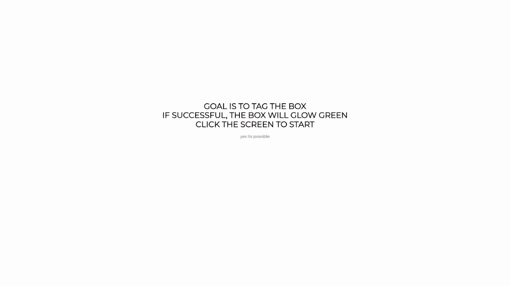

# Square Tag
The goal of this game is to tag the square! The square will be running away from your cursor.
This game is not available on mobile devices due to game being cursor dependent.

**Link to project:** https://squaretag.netlify.app/

## How It's Made:

**Tech used:** HTML, CSS, JavaScript, Node.js

To win the game, one must tag the square and if done correctly the square will become green and the player will be alerted of their victory. Each square is given 2 outcomes, either hiding itself and presenting another square, or turning green and giving the alert. The former being given a 'mouseenter' event listener and the latter being given a 'click' event listener. You are essentially racing the computer to force it to accept the click before the mouseenter function runs, which will hide the square that you are supposed to click.

## Examples:
Take a look at these couple examples where I used similar practices.

**MC Modpack Discovery:** https://github.com/boonaki/mc-modpackdb

**HH Tic Tac Toe:** https://github.com/boonaki/HHTicTacToe

